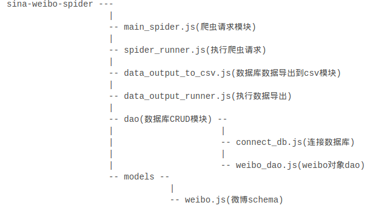

# README

------

## 运行要求

- 所在操作系统需安装Node.js、npm、mongoDB，运行前请确保mongoDB服务已开启
- 在项目主目录下执行以下命令开始爬取
  ```
  npm install && npm start
  ```
- 爬取结束后，使用命令将数据导出为csv文件
  ```
  node data_output_runner
  ```
------

## 爬虫需求
爬虫的需求是，根据所给出的话题案例，找到每个话题下转发数目最多的微博，分别爬取出微博的内容、时间、博主粉丝量、微博转发量、评论量、点赞数。

------

## 内容需求

1. 哈尔滨“天价鱼”事件
2. 山东问题疫苗事件
3. 常州外国语学校毒地事件
4. 青年魏则西之死
5. 雷洋事件
6. 和颐酒店女子遇袭事件
7. 中关村二小疑似“校园欺凌”现象
8. 泸州中学生跳楼事件
9. 丽江游客餐厅被殴打
10. 长春婴儿被盗

------

## 技术选取
根据需求，我们先使用chrome浏览器的开发者工具，借助network分析微博前端渲染时如何请求并加载我们想要的数据。通过对请求的追踪分析，发现上述所需要的数据来源都是可以通过xhr获取的。

而在爬虫语言的选取上，我选用了基于V8引擎的Javascript环境Node.js。Javascript本身就是一门广泛使用于网络开发的编程语言，在爬虫开发上具有先天优势，并且可以进行敏捷快速的开发。

另外，使用npm托管组件cheerio和request等可以为爬虫的数据获取还有解析提供相当大的便利。因此在整个程序的设计上，选取request作为http请求工具，使用cheerio和Node自带的JSON工具作为数据处理的的工具。

获取数据之后，需要对数据进行持久化。我们选取mongoDB这一NoSQL数据库，可以便捷地存取json对象。将爬取到的数据存入数据后，我们再使用js脚本对数据导出到csv文件，之后再转换成便于做数据分析处理的excel表格。

整个程序的运行流程就是：
1. http请求获取json数据
2. 使用解析工具解析返回的数据
3. 验证数据的合法性并做查重之后，将数据存入数据库
4. 将数据库数据导出

------

## 项目结构说明

